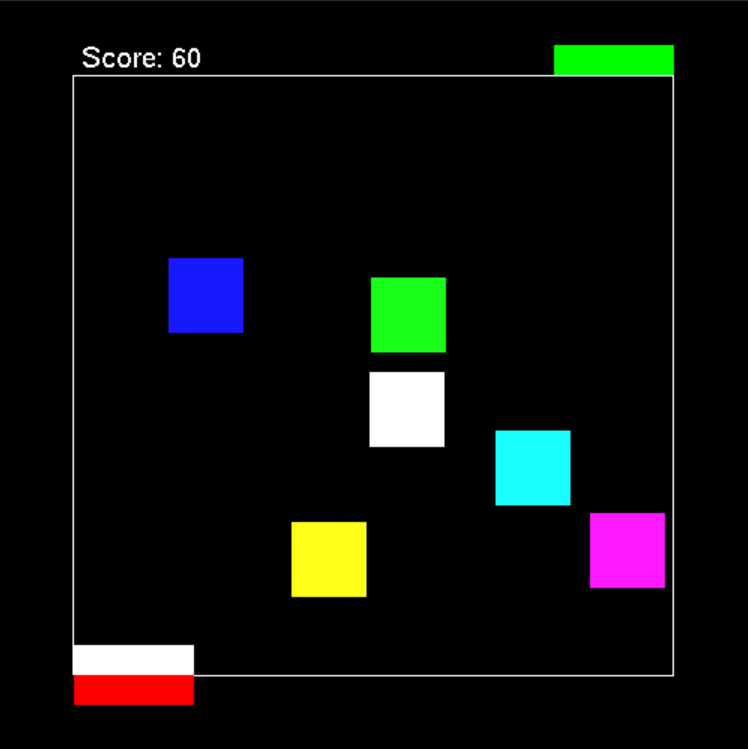

# 2DCarGame-OpenGL
A super fun 2D car game created using OpenGL. The goal is to traverse past the obstacles and make it out of the level to increase your score.

Implemented features:
* 2D Box Collision
* Player movement
* Player rotation
* Grid ON and OFF
* Score/Points system
* Keyboard interaction
* Mouse interaction (right-click)

